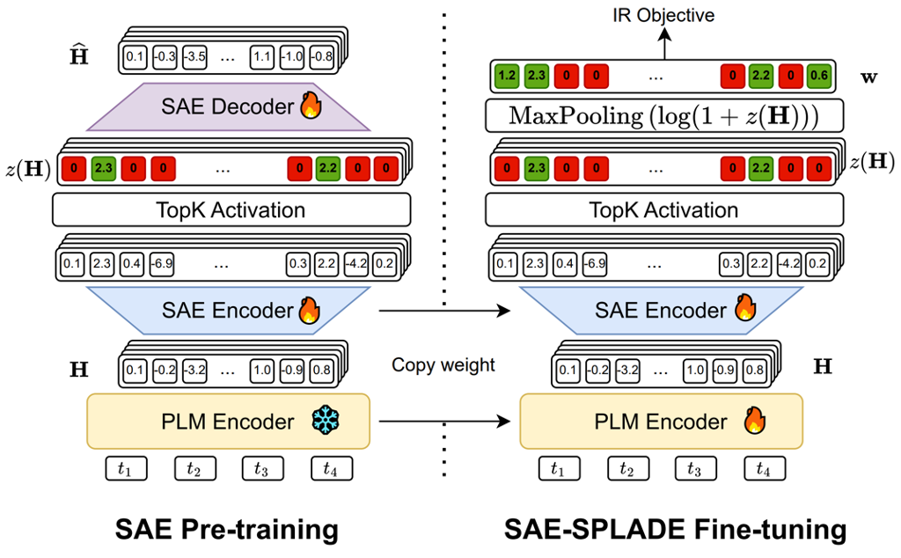

<!-- From Tokens to Concepts: Leveraging SAE for SPLADE
===

This repository contains all the details, configurations and scripts necessary in order to reproduce the experiments led in the context of the paper *From Tokens to Concepts: Leveraging SAE for SPLADE* by [Yuxuan Zong](https://www.linkedin.com/in/yuxuan-zong-943a42207/), [Mathias Vast](https://scholar.google.com/citations?user=QGCo1PAAAAAJ&hl), Basile Van Cooten, [Laure Soulier](https://scholar.google.fr/citations?user=3gUQp6oAAAAJ&hl) and [Benjamin Piwowarski](https://www.piwowarski.fr/), that was accepted at SIGIR 2026. -->

<div align="center">

<h1>From Tokens to Concepts: Leveraging SAE for SPLADE</h1>
<div>
    <a href=https://www.linkedin.com/in/yuxuan-zong-943a42207/ target='_blank'>Yuxuan Zong</a><sup>1</sup>&emsp;
    <a href='https://scholar.google.com/citations?user=QGCo1PAAAAAJ&hl' target='_blank'>Mithias Vast</a><sup>12</sup>&emsp;
    <a target='_blank'>Basile van Cooten</a><sup>2</sup>&emsp;
    <a href='https://scholar.google.fr/citations?user=3gUQp6oAAAAJ&hl' target='_blank'>Laure Soulier</a><sup>1</sup>&emsp;
    <a href='https://www.piwowarski.fr' target='_blank'>Benjamin Piwowarski</a><sup>1</sup>&emsp;
</div>
<br>
<div>
    <sup>1</sup>Sorbonne Université, CNRS, ISIR, F-75005 Paris, France&emsp;<br>
    <sup>2</sup>ChapsVision, Paris, France&emsp;<br>
</div>
<br>


</div>

## Table of Contents


* [Installation](#installation)
* [Experiments Reproduction](#experiments-reproduction)
* [Analysis](#analysis)
* [Contact](#contact)
* [Citation](#citation)

## Abstract

> _Learned Sparse IR models, such as SPLADE, offer an excellent efficiency-effectiveness tradeoff.
However, they rely on the underlying backbone vocabulary, which might hinder performance (poly-semanticity and synonymy) and poses a challenge for multi-lingual and multi-modal usages.
To solve this limitation, we propose to replace the backbone vocabulary with a latent space of semantic concepts learned using Sparse Auto-Encoders (SAE).
Throughout this paper, we study the compatibility of these 2 concepts, explore training approaches and analyze the differences between our SAE-SPLADE model and traditional SPLADE models.
Our experiments demonstrate that SAE-SPLADE achieves retrieval performance comparable to SPLADE on both in-domain and out-of-domain tasks, while offering improved efficiency.

## Installation

1. Clone the repository
````unix
git clone https://github.com/yzong12138/sae_splade.git
````
2. install [`uv`](https://docs.astral.sh/uv/getting-started/installation/) for fast package management.
3. Within the project directory, run `uv sync` to install all the needed packages. This will also create a `.venv`
4. Optional: `uv run pre-commit install` if you want to ensure consistent formatting and code checking.

### Experimaestro configuration

The repository is build based on the [experimaestro-ir](https://github.com/experimaestro/experimaestro-ir) framework, which is a repository providing many basic key components in doing IR experiments, including learning, indexing, evaluating, etc. Our dataset access is done under the [ir-datasets](https://github.com/allenai/ir_datasets/) package, through the interface of [datamaestro](https://github.com/experimaestro/datamaestro_text).

You should setup [some workspace](https://experimaestro-python.readthedocs.io/en/latest/settings/) that specifies where the output of the experiments are located

When running on a SLURM cluster, you might also need to create a `launchers.py` file as documented [here](https://experimaestro-python.readthedocs.io/en/latest/launchers/).

Finally, you can read the [experimaestro tutorial](https://experimaestro-python.readthedocs.io/en/latest/tutorial/)

### Experimental Plan


## Experiments Reproduction

In this part, we describe how to reproduce the results presented in the paper. Following the [experimaestro framework](https://experimaestro-python.readthedocs.io/en/latest/), the whole pipeline of indexing, training, evaluating are defined under *Experiment* scripts, controlled by configuration file written in YAML, and every hyperparameters' role and default value are defined at [src/experiments/configuration.py](src/experiments/configuration.py). Examples of such files are available under the [experiments](src/experiments) folder of the repository. More precisely, the folder [src/experiments/sae](src/experiments/sae) contains the code for the SAE pretraining over the corpus, while the [src/experiments/sae_splade](src/experiments/sae_splade) contains the code for the SAE-pretraining + SAE-SPLADE finetuning.

For instance, inside the folder [src/experiments/sae_splade/base](src/experiments/sae/base) we provide different ablations we studied in this work: [normal_ab_layer.yaml](src/experiments/sae/base/normal_ab_layer.yaml) is for the ablation over the number of layers for the PLM to get the hidden state to train SAE; [normal_ab_sae_width.yaml](src/experiments/sae/base/normal_ab_sae_width.yaml) contains the ablation that we varies the value of $M$ in the paper, etc. Thanks to experimaestro, we can launch a batch of experiments which loop over the studying hyperparameters (e.g., $M = 2^{15}, 2^{16}, 2^{17}$ inside one single `.yaml` file).

The other baseline or multilingual experiments are located in different corresponding folders.

### Dataset

We make use of the package [`ir-datasets`](https://ir-datasets.com/) together with [`datamaestro`](https://github.com/experimaestro/datamaestro_text) to facilitate the access of the datasets in our experiments. Currently the

To use other dataset, please use the following command to check the availability:
```unix
datamaestro search <dataset_name>
```

The dataset involved in the evaluation could be adjust through the option `retrieval.eval_on_beir` or `retrieval.eval_on_mcl`. Currently the composition of the BEIR and LoTTE dataset is hard-coded, but could be easily adapted by modifying the code at [src/utils/datasets.py](src/utils/datasets.py) (e.g., removing or adding items in the method `msmarco_beir_evaluation_sets` and `msmarco_beir_evaluation_documents`).

#### Distillation Samples

Please replace the `distil_data_path` in the `.yaml` to the path where where you store the distillation samples provided by the [ColBERTv2](https://github.com/stanford-futuredata/ColBERT). You can download it by:

```unix
wget https://huggingface.co/colbert-ir/colbertv2.0_msmarco_64way/resolve/main/examples.json?download=true
```

### Example

Here we give some example of running experiments. They include the data-preprocessing, SAE pretraining, SAE-SPLADE finetuning, indexing, evaluation.

1. Baseline SPLADE on the BERT-base size of model.
````unix
uv run experimaestro run-experiment src/experiments/sae_splade/baseline_splade/normal_bert_base.yaml --workdir /your/working/directory/
````

2. SAE-SPLADE on which varies different $k_{\mathtt{SAE}}$ and $k_{\mathtt{SPLADE}}$ values for based on Hierarchical TopK SAE.
````unix
uv run experimaestro run-experiment src/experiments/sae_splade/base/normal_topk.yaml --workdir /your/working/directory/
````

3. SAE-SPLADE on different $k$ and FLOPs Regularization: Joint experiments of 3 $k$ values and 3 FLOPs Regularization magnitude result in 9 SAE-SPLADE training experiments in total.
````unix
uv run experimaestro run-experiment src/experiments/sae_splade/base/normal_ab_flops_regu.yaml --workdir /your/working/directory/
````

... and many many more!

Alternatively, if you want to make sure that everything is setup correctly before starting your experiment, you can add the option `--run-mode dry-run` to the command above to go over the experimental plan without launching the task.

## Analysis

We also provide the jupyter notebook for our result analysis and the code for T-test [here](notebooks). Before launching, please make sure that the PYTHONPATH is correctly settled at [src](src).

## Contact

Please feel free to email Yuxuan or Mathias or academic' supervisor Benjamin at (name).(surname)@isir.upmc.fr

## Citation

Comming soon.
